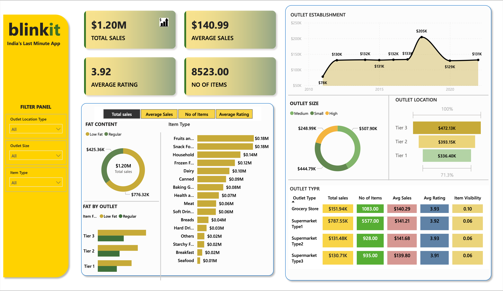
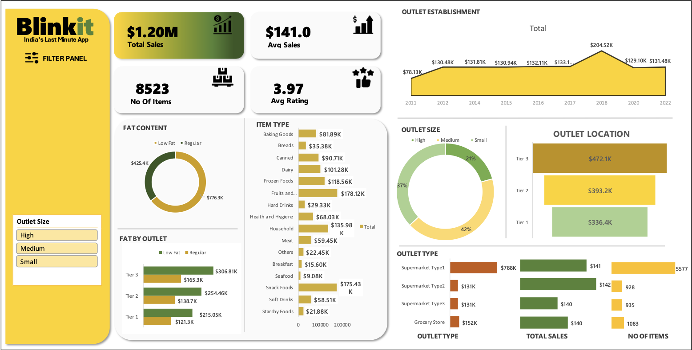

# 🛒 Blinkit Sales Analytics Dashboard  
### 📊 Power BI & Excel Project | Business Intelligence | Retail Analytics

---

> **A retail business intelligence project transforming Blinkit sales data into actionable insights using Power BI and Excel.**  
> Designed to support data-driven decision-making across sales, product strategy, and outlet performance.

---

## 💼 About the Project

This project simulates a real-world retail analytics scenario for **Blinkit**, a leading instant delivery platform in India. The goal was to analyze historical sales data and identify trends across:

- 📦 Product categories  
- 🏬 Outlet performance (type, size, tier)  
- 🧈 Fat content preferences  
- ⭐ Customer feedback  
- 🧭 Geographic segmentation  

📁 **Deliverables:**  
- 🔹 Dynamic **Power BI Dashboard**  
- 🔹 Static **Excel Dashboard**  

---

## 🧠 Analytical Approach

- 📚 **Data Understanding:** Reviewed column-level data and identified key variables (Sales, Ratings, Item Types, Tiers, etc.)  
- 🧹 **Data Cleaning:** Removed nulls, handled data types, created categories, and unified naming conventions  
- 🧮 **KPI Computation:** Used Excel formulas and DAX in Power BI to derive key metrics like average sales, ratings, and item count  
- 📊 **Visualization Strategy:** Created clean, business-ready dashboards with filter panels, trend charts, and category comparisons  
- 🎯 **Insight Extraction:** Identified patterns that impact revenue, category performance, and customer satisfaction  

---

## 🛠️ Tools & Technologies Used

| Tool / Platform     | Purpose                                      |
|---------------------|----------------------------------------------|
| 📊 Power BI          | Interactive dashboarding and drilldown KPIs |
| 📈 Microsoft Excel   | Static dashboards, pivot analysis            |

---

## 📌 Core Skills Demonstrated

✅ Business Intelligence  
✅ Data Cleaning & Transformation  
✅ Retail Analytics  
✅ Dashboard UI/UX Design  
✅ Storytelling with Data  
✅ Functional KPI Development  
✅ Segmentation Analysis  

---

## 📈 Key Performance Indicators (KPIs)

| KPI                         | Value        |
|-----------------------------|--------------|
| **Total Sales**             | $1.20M       |
| **No. of Items Sold**       | 8,523        |
| **Average Sales per Item**  | ~$141        |
| **Average Rating**          | ~3.9         |
| **Low Fat Item Sales**      | $776.3K      |
| **Regular Fat Item Sales**  | $425.4K      |

---

## 🔍 Key Insights

- 🏪 **Supermarket Type 1** drives the highest revenue (~$788K) — most impactful outlet type  
- 🧈 **Low Fat items** outperform Regular by a large margin — signals a shift in consumer preferences  
- 🏙️ **Tier 3 outlets** surprisingly outperform others — market potential in smaller cities  
- 🏗️ **Medium-sized outlets** are the sweet spot in performance — optimized for sales and experience  
- 🍏 **Top Item Types:** Fruits & Veggies, Snack Foods, Household, and Dairy account for most of the revenue  
- ⭐ **Consistent Ratings (~3.9+)** across all outlet types — customer satisfaction is stable  

---

## 📌 Dashboard Snapshots

### 📊 Power BI Dashboard  
Interactive filters, advanced segmentation, dynamic KPIs, and category breakdowns.

---

### 📈 Excel Dashboard  
Well-structured pivot visuals, summary KPIs, category slicers for business insights at a glance.

---

## 💼 Business Use Cases

- 🔹 Sales strategy optimization by outlet type and region  
- 🔹 Category performance tracking for seasonal planning  
- 🔹 Product assortment strategy (Low Fat vs Regular)  
- 🔹 Outlet performance benchmarking across sizes and tiers  
- 🔹 Executive reporting for CXOs and product managers  

---

## 💡 Why This Project Matters

> This project demonstrates my ability to **extract insights**, **build intuitive dashboards**, and communicate trends in a way that helps **non-technical stakeholders make better business decisions**.  
It combines the strengths of **BI tools**, **analytical thinking**, and **data storytelling** — all critical skills in today’s data-driven roles.

---
